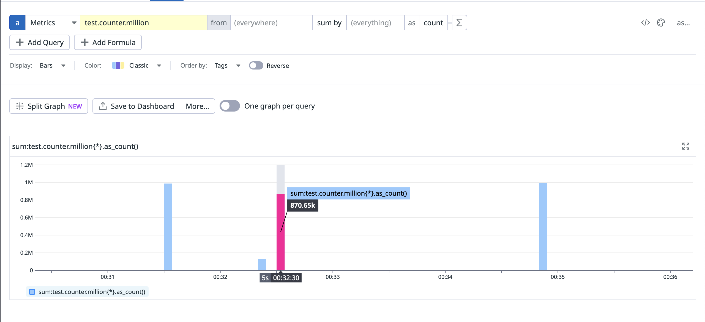
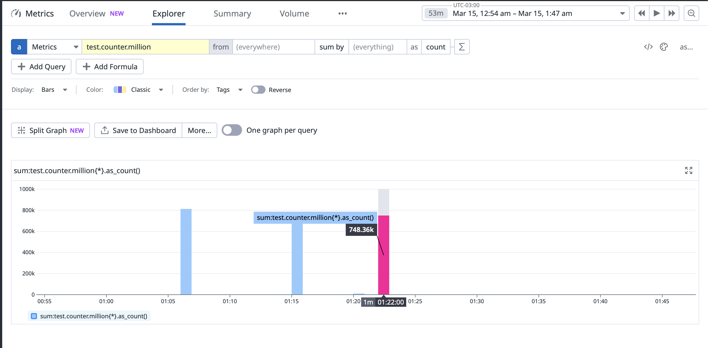
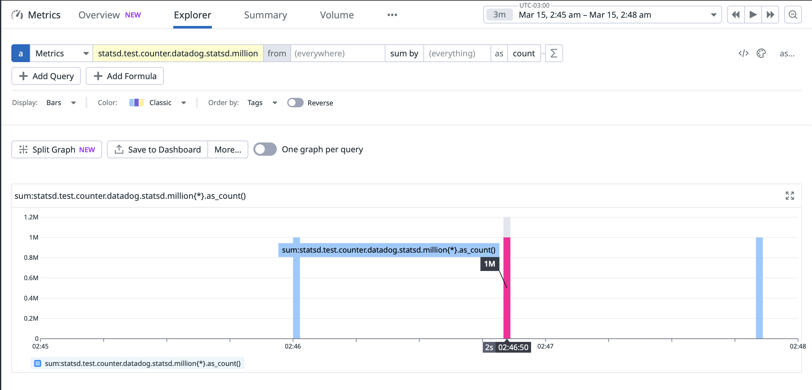

# Export Metrics to DataDgo With StatsD

When exporting metrics using the micrometer statsd registry under heavy loads, some metrics are missing.

## Testing With Micrometer

In the test scenario, 1 million counts were sent to Datadog through micrometer statsd.

- When sending sequentially, approximately 950,000 were received.
  
- When sending in parallel, approximately 750,000 were received.
  

Even after tuning the configurations, the problem persisted.

The issue is described [here](https://github.com/micrometer-metrics/micrometer/issues/2908).

## Testing With Dogstatsd

To address this issue, the dogstatsd library was employed to transmit the metrics. Through meticulous configuration
adjustments, it successfully sent 1 million counts without any data loss.



### Configuration

A few configurations managed to achieve the 1 million count threshold.

The most crucial configuration is the queueSize, which serves as a buffer to store metrics that have been processed but
not yet sent.

```java
StatsDClient statsd = newNonBlockingStatsDClientBuilder()
        .prefix("statsd")
        .hostname("localhost")
        .port(8125)
        .queueSize(650000)
        .build();
```

When the queueSize is set to around 650k, it was able to send 1 million counts without losing most of the metrics.

To further optimize performance, additional tests were conducted with more than one senderWorkers using threads. In this
scenario, 10 was the optimal value for senderWorkers. Notably, virtual threads proved to be significantly more efficient
compared to system threads.

```java
StatsDClient statsd = newNonBlockingStatsDClientBuilder()
        .prefix("statsd")
        .hostname("localhost")
        .port(8125)
        .queueSize(550000)
        .senderWorkers(10)
        .threadFactory(Thread.ofVirtual().factory())
        .build();
```

# How to Run

To conduct the experiment, I utilized the free trial DataDog account hosted on the us5 server. 

## DataDog Agent

To send the metrics to DataDog, a Datadog agent is necessary. The agent can be executed using the following command:

```shell
docker run -d --name dd-agent \
--cgroupns host \
-e DD_API_KEY=<DD_API_KEY> \
-e DD_SITE="us5.datadoghq.com" \
-e DD_DOGSTATSD_NON_LOCAL_TRAFFIC="true" \
-v /var/run/docker.sock:/var/run/docker.sock:ro \
-v /proc/:/host/proc/:ro \
-v /sys/fs/cgroup/:/host/sys/fs/cgroup:ro \
-v /var/lib/docker/containers:/var/lib/docker/containers:ro \
-p 8125:8125/udp \
gcr.io/datadoghq/agent:7
```

Alternatively, it can be managed using the [docker-compose](docker-compose.yml) file.

## Spring Boot Application

To switch the library that will be used, simply modify the `@EventListener` annotation to correspond to the desired method in the [DataDogMetrics](src/main/java/com/magnus/datadog_metrics_test/metrics/DatadogMetrics.java) class.
