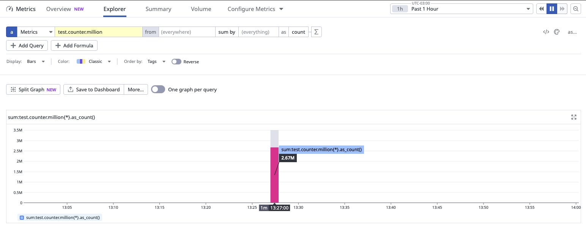
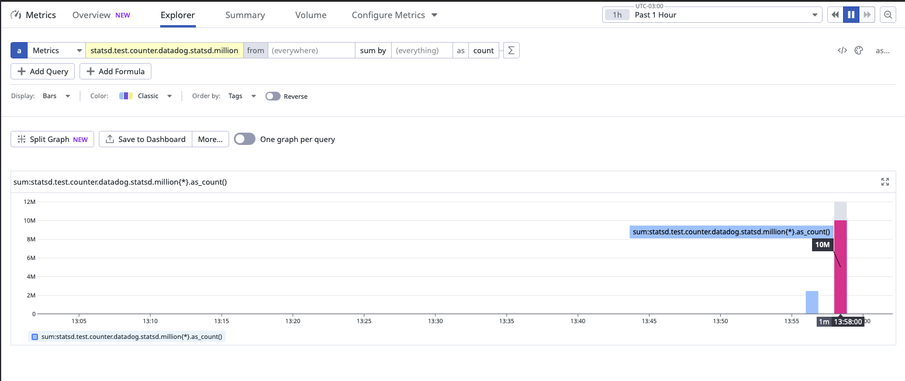

# Export Metrics to DataDgo With StatsD

When exporting metrics using the micrometer statsd registry under heavy loads, some metrics are missing.

This project is a proof of concept and was created to show the best choice for heavy load metrics sending to DataDog
with Statsd.

> [!IMPORTANT]
> The methods employed for testing were not entirely accurate in accordance with the scientific convention.

# Table of Contents

1. [Testing With Micrometer](#testing-with-micrometer)
2. [Testing With Dogstatsd](#testing-with-dogstatsd)
    1. [Configuration](#configuration)
3. [Testing Extrapolation](#testing-extrapolation)
4. [Considerations](#considerations)
5. [Memory Usage](#memory-usage)
    1. [Test Environment](#test-environment)
    2. [Results](#results)
6. [How to Run](#how-to-run)
    1. [DataDog Agent](#datadog-agent)
    2. [Spring Boot Application](#spring-boot-application)

## Testing With Micrometer

In the test scenario, 1 million counts were sent to Datadog through micrometer statsd.

When sending sequentially, approximately 950,000 were received.


When sending in parallel, approximately 750,000 were received.


Even after tuning the configurations, the problem persisted.

The issue is described [here](https://github.com/micrometer-metrics/micrometer/issues/2908).

## Testing With Dogstatsd

To address this issue, the dogstatsd library was employed to transmit the metrics. Through meticulous configuration
adjustments, it successfully sent 1 million counts without any data loss.


### Configuration

A few configurations managed to achieve the 1 million count threshold.

The most crucial configuration is the queueSize, which serves as a buffer to store metrics that have been processed but
not yet sent.

```java
StatsDClient statsd = newNonBlockingStatsDClientBuilder()
        .prefix("statsd")
        .hostname("localhost")
        .port(8125)
        .queueSize(650000)
        .build();
```

When the queueSize is set to around 650k, it was able to send 1 million counts without losing most of the metrics.

To further optimize performance, additional tests were conducted with more than one senderWorkers using threads. In this
scenario, 10 was the optimal value for senderWorkers. Notably, virtual threads proved to be significantly more efficient
compared to system threads.

```java
StatsDClient statsd = newNonBlockingStatsDClientBuilder()
        .prefix("statsd")
        .hostname("localhost")
        .port(8125)
        .queueSize(550000)
        .senderWorkers(10)
        .threadFactory(Thread.ofVirtual().factory())
        .build();
```

## Testing Extrapolation

To account for the graphs above, results close to 1 million counts were extrapolated using 10 million counts.

Parallel usage of the micrometer statsd registry with 10 million counts resulted in approximately 2.65 million counts.


Using the dogstatsd library, ten million counts were processed in parallel, resulting in a total of 10 million counts. (
The small bar was an attempt with a small queue size)


# Considerations

When using the dogstatsd library, it’s crucial to understand that the library relies on the queue size. If a metric
exceeds the queue’s capacity, it will be discarded.
For the 10 million count test, I used a queue of size 10 million, which is not recommended because it will allocate up
to 10 million "spaces" in memory, but will ensure that all the metrics are going to be sent.

> [!IMPORTANT]
> The queue size depends on the available memory and the number of metrics generated per flush.

Additionally, the dogstatsd metric `datadog.dogstatsd.client.packets_dropped_queue` can be used to monitor the number of
messages dropped from the queue. This metric is exported to Datadog, allowing the creation of an alarm to track the
number of dropped messages.

#### Properties

The properties that helped the most to increase performance were:

- queueSize
- senderWorkers
- aggregationShards
- aggregationFlushInterval

## Memory Usage

Comparing the memory usage fo the two libraries.

### Test Environment

When conducting the experiment to measure memory usage, the JVM Heap usage was recorded. Initially, right after
launching the application, the Heap usage was observed to be between 24 to 50 MB. The available memory was set to 2 GB.

Considering that the application’s sole purpose is to send metrics to DataDog and maintain the web server’s
functionality, it is reasonable to expect such low memory usage during the initialization phase.

To be fair, the DogStatsD experiment used the worst-case scenario. The queue size was set to 10 million to be able to
accommodate all metrics waiting to be sent. The default parameters were used for the Micrometer statsd.

### Results

The table below shows the memory usage for both libraries.

| Library    | Memory Usage |
|------------|--------------|
| Micrometer | ~1 GB        |
| DogStatsD  | ~850 MB      |

The memory usage on both devices is quite similar, even though DogStatsD has a large queue size, it still manages to use
less memory.

On both libraries the GC is was able to clean the heap after all metrics were sent.


> [!TIP]
> A bean [configuration](src/main/java/com/magnus/datadog_metrics_test/config/DogStatsDConfig.java)
> and [configuration properties](src/main/java/com/magnus/datadog_metrics_test/config/DogStatsDProperties.java) were
> created to use with Spring Boot.

# How to Run

To conduct the experiment, I utilized the free trial DataDog account hosted on the us5 server.

## DataDog Agent

To send the metrics to DataDog, a Datadog agent is necessary. The agent can be executed using the following command:

```shell
docker run -d --name dd-agent \
--cgroupns host \
-e DD_API_KEY=<DD_API_KEY> \
-e DD_SITE="us5.datadoghq.com" \
-e DD_DOGSTATSD_NON_LOCAL_TRAFFIC="true" \
-v /var/run/docker.sock:/var/run/docker.sock:ro \
-v /proc/:/host/proc/:ro \
-v /sys/fs/cgroup/:/host/sys/fs/cgroup:ro \
-v /var/lib/docker/containers:/var/lib/docker/containers:ro \
-p 8125:8125/udp \
gcr.io/datadoghq/agent:7
```

Alternatively, it can be managed using the [docker-compose](docker-compose.yml) file.

## Spring Boot Application

To create a metric simply make a POST call:

- For micrometer use the addresss http://localhost:8080/micrometer
- For dogstatsd use the addresss http://localhost:8080/dogstatsd

The metrics real call are on
the [DataDogMetrics](src/main/java/com/magnus/datadog_metrics_test/metrics/DatadogMetrics.java) class.

> [!NOTE]
> The class in configured to send 10 million counts.

